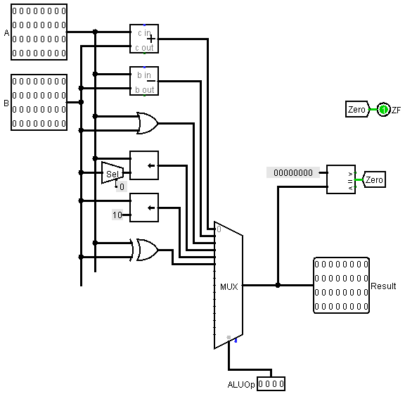
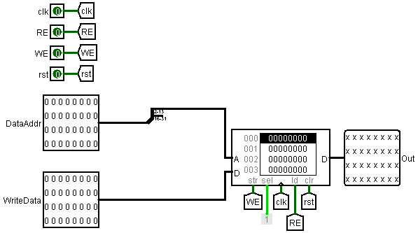
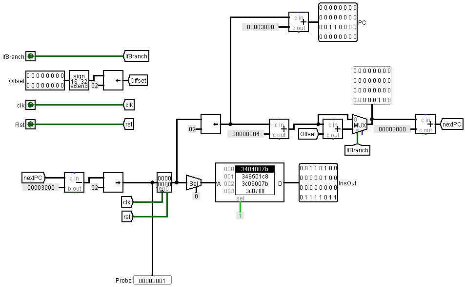
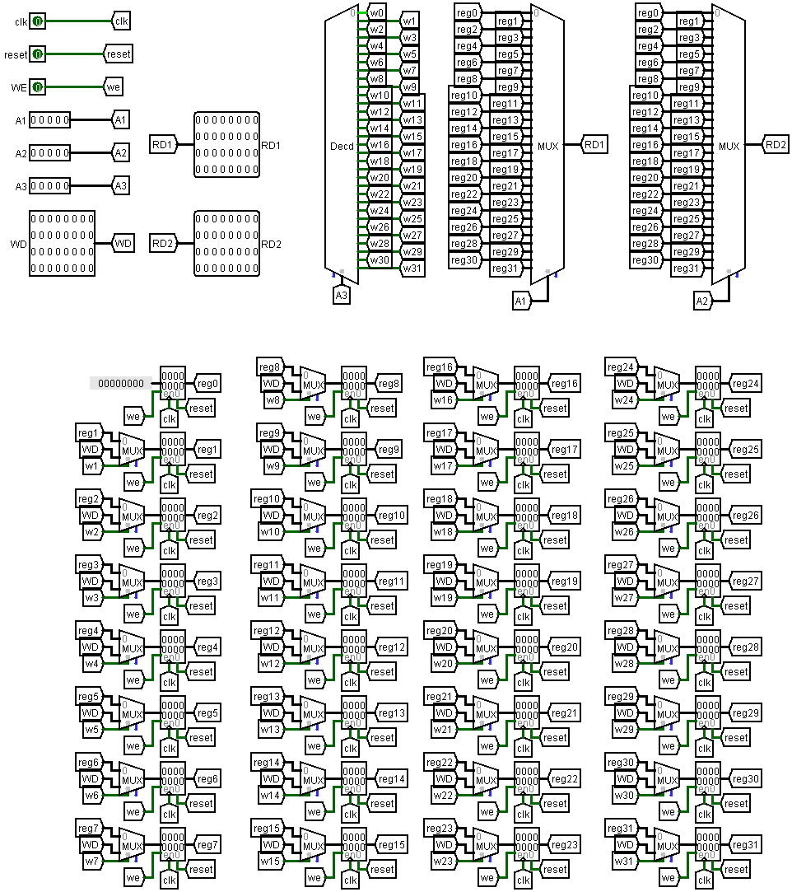
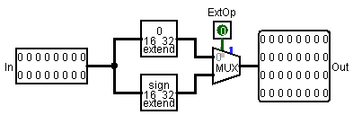
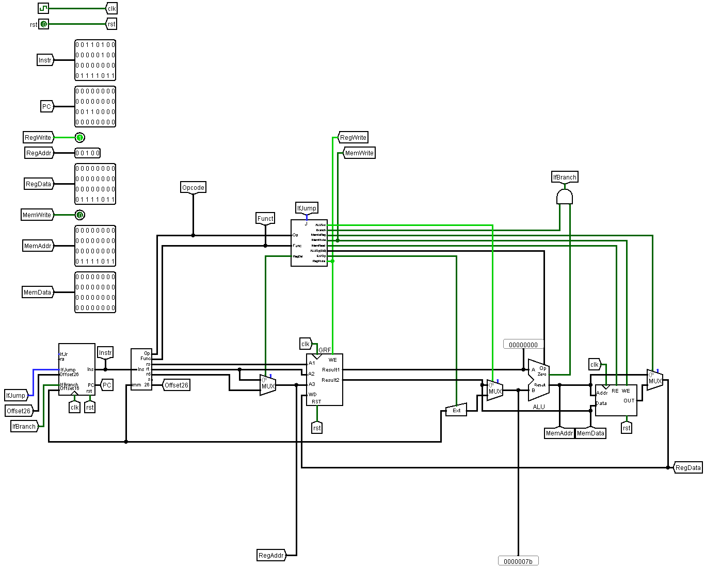

# Design Document

文档包括三个部分: 
1. CPU设计
2. 思考题及回答
3. 测试方案


## 第一部分：CPU设计草稿及说明
本次课下P3所设计的CPU需要满足以下指令：
|Ins    |31-26  |25-21  |20-16  |15-11      |10-6   |5-0    |
|-------|-------|-------|-------|-----------|-------|-------|
|       |Opcode |       |       |           |       |Func   |
|add    |000000 |rs_5   |rt_5   |rd_5       |00000  |100000 |
|sub    |000000 |rs_5   |rt_5   |rd_5       |00000  |100010 |
|ori    |001101 |rs_5   |rt_5   |imm_16     |       |       |
|lw     |100011 |base_5 |rt_5   |offset_16  |       |       |
|sw     |101011 |base_5 |rt_5   |offset_16  |       |       |
|beq    |000100 |rs_5   |rt_5   |offset_16  |       |       |
|lui    |001111 |00000  |rt_5   |imm_16     |       |       |
|nop    |000000 |00000  |00000  |00000      |00000  |000000 |
|jal    |000011 |imm_26 |       |           |       |       |
|jr     |000000 |rs_5   |00000  |00000      |00000  |001000 |

下面分不同模块对指令进行说明:eyes:

### 1. Control Unit:fire:
#### 介绍
控制信号的说明如下，其中最主要的说明应该是在`lui`和`nop`上，因为前面的指令在教程中都有给出。

`Branch`信号是与教程上`nPC_sel`信号等价的。`Branch`的命名是参考理论课所授的内容。

Control_Unit的输出在不同的指令下体现如下：
|Output     |add    |sub    |ori    |lw |sw |beq    |lui    |nop    |Note           |
|-----------|-------|-------|-------|---|---|-------|-------|-------|---------------|
|ALUSrc     |0      |0      |1      |1  |1  |0      |1      |0      |A3==A2?        |
|Branch     |0      |0      |0      |0  |0  |1      |0      |0      |               |
|MemtoReg   |0      |0      |0      |1  |x  |x      |0      |0      |LoadMem        |
|MemWrite   |0      |0      |0      |0  |1  |0      |0      |0      |Store?         |
|MemRead    |0      |0      |0      |1  |0  |0      |0      |0      |ReadMem?       |
|ALUOp[3:0] |0      |1      |2      |0  |0  |5      |4      |3      |               |
|ExtOp      |0      |0      |0      |1  |1  |1      |x      |0      |signExt?       |
|RegWrite   |1      |1      |1      |1  |0  |0      |1      |x      |               |
|RegDst     |1      |1      |0      |0  |x  |x      |0      |x      |Store to A2?   |

#### 端口定义
|信号名 |方向   |位宽   |描述   |
|:--:|:--:|:--:|:--|
|Op         |I  | 6 |指令的高6位    |
|Func       |I  |32 |指令的低6位    |
|ALUSrc     |O  |1  |决定ALU的第二位操作数来源于寄存器还是立即数扩展|
|Branch     |O  |1  |是否是分支类型的指令|
|MemtoReg   |O  |1  |写入寄存器的数据是否来源于内存|
|MemWrite   |O  |1  |是否有内存写入|
|MemRead    |O  |1  |是否有内存读取|
|ALUOp      |O  |4  |ALU操作指令，详见ALU|
|ExtOp      |O  |1  |对立即数的扩展是否是符号扩展|
|RegWrite   |O  |1  |是否有需要对寄存器进行写入|
|RegDst     |O  |1  |写入的寄存器是否是rd|
|Jump       |O  |1  |判断是否需要执行J类型指令|

#### 设计图


### 2. ALU:zap:
#### 介绍
`ALUOp[3:0]`是传输给ALU的信号，用以控制ALU的运算。详细的规定如下：
|ALUOp[3:0] |作用          |备注           |
|:----:     |:---               |   :--         |
|0x0        |result = A + B     |               |
|0x1        |result = A - B     |               |
|0x2        |result = A \| B     |               |
|0x3        |result = A << B    |               |
|0x4        |result = B << 0xA  |used for lui   |
|0x5        |result = A xor B   |               |

#### 端口定义
|信号名 |方向   |位宽   |描述   |
|:--:|:--:|:--:|:--:|
|A      |I  |32 |第一位操作数   |
|B      |I  |32 |第一位操作数   |
|ALUOp  |I  |4  |操作指令       |
|ZF     |O  |1  |Zero Flag      |
|Result |O  |32 |结果           |

* 注：
1. 其中异或指令`0x5`在P3的课下设计中没有使用。设计的初衷是用于满足
`beq`操作，而根据P3的tutorial，`beq`操作由减法操作`0x1`完成。此处仍然保留是考虑到P3实验课上使用的潜在可能。
2. `add` `lw` `sw`均进行add操作（`0x0`），`beq` `sub`指令均进行`sub`
操作（`0x1`）。
3. ALUOp采用了4位的位宽实现，是基于课上对指令进行拓展测试时超出2位位宽的潜在可能
#### 设计图


### 3. DM:ocean:
#### 介绍
`DM`和`IFU`都涉及到*Memory access*的问题。这次本次P3最大的特点在于采用32位RAM和ROM而非8位的，因此在访问的过程中无须考虑以`byte` `half-word`的单位的访存操作。在之后的设计中应该要考虑将8位的RAM和ROM进行位扩展再进行存储。

DM中RAM拥有12位地址线和32位数据线。
#### 端口定义
|信号名 |方向   |位宽   |描述   |
|:--:|:--:|:--:|:--:|
|clk        |I  |1  |时钟信号   |
|RE         |I  |1  |读使能信号 |
|WE         |I  |1  |写使能信号 |
|rst        |I  |1  |异步复位信号   |
|DataAddr   |I  |32 |所选数据的地址   |
|WriteData  |I  |32 |写入的数据   |
|Out        |O  |32 |读取的数据   |

#### 功能说明
|功能名称|功能描述  |
|:---:|:---:|
|写入数据   |当WE信号为高电平时，在clk上升沿将WriteData写入<br>DataAddr对应RAM内存中|
|读取数据   |当RE信号为高电平时，将RAM在DataAddr处的数据读取<br>至Out中|
|重置       |rst信号为高电平时，将RAM中的数据全部置零|

#### 设计图


### 4. IFU:deciduous_tree:
#### 介绍
IFU模块用于存储指令，将当前指令输出至输出端并根据输入信号计算出下一条指令的位置和内容

#### 端口定义
|信号名 |方向   |位宽   |描述   |
|:--:|:--:|:--:|:--:|
|clk        |I  |1  |时钟信号|
|rst        |I  |1  |异步复位信号|
|ifBranch   |I  |1  |分支信号|
|OffSet     |I  |16 |偏移值，用于`Branch`类型指令|
|PC         |O  |32 |程序计数器值，主要用于检查错误<br>可封装在IFU内部|
|InsOut     |O  |32 |输出当前指令内容|

#### 功能说明
|功能名称   |功能描述   |
|:---:|:---:|
|分支指令|当IfBranch信号为高电平时，将PC置为`PC + 4 + Offset`|
|指令递增|当IfBranch信号为低电平时，将PC置为`PC + 4`|

* **注**：当前IFU未实现J类指令，因此没有将J类指令的低26位接入IFU的考虑。

#### 设计图


### 5. GRF:maple_leaf:
#### 介绍
GRF采用P0所设计的GRF，除了适当调整模块外观以外没有其他变化。

下述端口定义和功能实现主要参考P0中对于GRF的说明
#### 端口定义
|信号名 |方向   |位宽   |描述   |
|:--:|:--:|:--:|:--:|
|clk    |I  |1  |时钟信号   |
|rst    |I  |1  |异步复位信号   |
|WE     |I  |1  |写使能信号   |
|A1     |I  |5  |5位地址输入信号，指定32个寄存器中的一个，<br>将其中存储的数据读出到`RD1`   |
|A2     |I  |5  |5位地址输入信号，指定32个寄存器中的一个，<br>将其中存储的数据读出到`RD2`|
|A3     |I  |5  |5位地址输入信号，指定32个寄存器中的一个<br>`RD1`将其中储存的数据读出到`RD2`|
|WD     |I  |32 |32位数据输入   |
|RD1    |O  |32 |`A1`对应的寄存器数据   |
|RD2    |O  |32 |`A2`对应的寄存器数据   |


#### 功能说明
|功能名称   |功能描述   |
|:---:|:---:|
|复位   |`reset`信号有效时将所有寄存器异步复位|
|读数据 |将`A1`，`A2`寄存器中的数据读出到`RD1`，`RD2`|
|写数据 |`WE`高电平时在时钟上升沿将`WD`写入`A3`对应寄存器|

#### 设计图



### 6. Ext:rocket:
#### 介绍
Ext模块用于将16位的输入输入信号根据ExtOp选择性地进行零扩展或符号扩展到32位

#### 端口定义
|信号名 |方向   |位宽   |描述   |
|:--:|:--:|:--:|:--:|
|In |I  |16 |输入信号|
|ExtOp  |I  |1  |扩展操作数<br>`0`表示零扩展<br>`1`表示符号扩展|

#### 功能说明
|功能名称   |功能描述   |
|:---:|:---:|
|零扩展|将16位输入信号的高位补0扩展到32位并输出|
|符号扩展|将16位输入信号的高位补符号位扩展到32位并输出|

#### 设计图


### 7. Splitter:whale:

#### 介绍
详细参见 *第二部分-Q3*

### 8. 顶层设计:hammer:



___

## 第二部分：思考题

### Q1：指出哪些模块发挥状态转移的功能? 哪些模块发挥状态储存的功能?
### A1：首先应当明确在CPU中什么是状态，什么是输入输出。
GRF产生的指令是输入这一点应该没有疑问。

状态的定义则相对模糊——原则上只要当前Memory与输入共同决定Memory的改变的Memory就能被视作一个状态。

P3的CPU中除了要求的输出信号以外没有输出,我们姑且把这些输出当做状态机的输出，这些输出有的是由当前状态决定的，比如MemData，有的输出是当前状态和输入共同决定的，比如RegWrite（确切地来说，这些输出中有很多是只与输入信号有关的）。

明确了状态，我们才能具体分析单周期CPU这个FSM。
#### 状态储存：
状态储存模块一定具备Memory功能，而带有Memory的模块有仨: `DM`的`RAM`、`IFU`的`ROM`以及`GRF`中的32个`Register`，**只有 GRF的Register 和 DM的RAM 能视为状态储存模块**。理由如下：
- `GRF`的`ROM`应当被视为输入。
- DM的RAM和GRF的Registers都可以与输入共同决定其内容的改变，即共同决定下一状态
- 经典的状态机在状态储存之外似乎不应当有其他具有记忆功能的部件。

#### 状态转移：
- 输入信号接受进来后，通过了`Control_Unit`、`ALU`、`Ext`并与当前状态（DM、GRF）共同决定下一状态，因此**ALU、Control_Unit、Ext都应当被视为状态转移模块，因为他们都和上一状态共同决定了下一状态，即都用于下一状态的转移计算**。

### Q2：现在我们的模块中IM 使用 ROM， DM 使用 RAM， GRF 使用 Register，这种做法合理吗？

### A2：仅在现阶段合理。

IM仅用于存放指令并将指令读取出来，而显然，在P3中，我们不会用现有的程序去修改这个程序本身，即不会对指令本身进行写入操作。因此**在当前情况，ROM——Read-Only-Memory——足够了**。

但是实际上，**当我们想要编写指令（让指令不只是可读，也可写）时，用ROM存储指令就是不妥善的了。**

另外，这种将IM和DM分开存放的方式似乎不是很正确，因为**存储的地址其实已经不连续了**。但是我们知道在MARS中数据区域和指令区域的地址是连在一起的：0x3000之后存放指令，之前存放数据。


### Q3：上述提示的模块之外，你是否在实际实现时设计了其他的模块？如果是的话，请给出介绍和设计的思路。

### A3：有。为指令设计了一个splitter。

#### Splitter

##### 介绍
考虑到`IFU`的输出后紧跟的splitter的连线太乱了,输出太多，写一个splitter专门分出指令的不同部分。

##### 端口定义
|信号名 |方向   |位宽   |描述   |
|:--:|:--:|:--:|:--:|
|Ins        |I  |32 |指令输入|
|Opcode     |O  |6  |Ins[31:26] |
|rs         |O  |5  |Ins[25:21] |
|rt         |O  |5  |Ins[20:16] |
|rd         |O  |5  |Ins[15:11] |
|s          |O  |5  |Ins[10:6]  |
|Func       |O  |6  |Ins[5:0]   |
|instr_index|O  |26 |Ins[25:0]，用于J类型指令  |

### Q4：事实上，实现 nop 空指令，我们并不需要将它加入控制信号真值表，为什么？

### A4：首先，nop指令对应的控制信号中，MemWrite必须是0，不管是默认为0还是主动设置为0。否则会对DM产生影响。让MemWrite默认为0也可以认为是没有加入控制信号真值表。
nop的Op和Func均为`000000`。一方面`nop`属于`sll`操作，而`sll`操作不在P3现有的支持指令中，我们并**不想**把它加入控制信号真值表；另一方面nop**不会产生任何影响**：
- MemWrite信号无效，**不会对DM产生影响**。
- 写入的目标寄存器为$0，**不会对GRF产生影响**。

因此，就算不加入控制信号真值表也不会产生任何影响，而**不会产生任何影响即已经实现`nop`操作**。

### Q5：阅读 Pre 的 “MIPS 指令集及汇编语言” 一节中给出的测试样例，评价其强度（可从各个指令的覆盖情况，单一指令各种行为的覆盖情况等方面分析），并指出具体的不足之处。

### A5：个人认为该节给出的测试样例属于是“麻雀虽小，五脏俱全”。测试样例总体来说比较强。

**先叙述个人对于评价测试样例强不强的判断指标。**

当前测试样例仅聚焦于测试CPU的正确性，因此样例的全面性（覆盖率）应当成为衡量测试样例的主要标准。个人认为全面性有几个方面的表现：
1. 指令种类的全面性。
2. 某一指令下是否涵盖尽量全面的情况。
3. 指令运行时CPU环境的多样性，比如初始条件下将寄存器先赋初值。这主要是为了发现bug。
4. 目标Register是否都有涵盖。这主要包含$0和$1-$31的寄存器测试.
5. 目标DM中的RAM的访存是否尽量有涵盖。这主要包括对地址边界的测试和边界内部的随机地址的测试。尽管在没有异常处理的P3中对边界条件的测试并不是那么重要。
6. 指令排布方式的全面性。当CPU设计存在缺陷时，指令之间可能会相互影响。

因此我认为MIPS_Pre的测试样例有以下几个问题：
1. `sw`和`lw`没有涉及到充分大的地址区域，也没有考虑`0x00002fff`处边界附近的lw和sw操作。
2. `sw`和`lw`为`Offset`作符号扩展，但却没有考虑到`Offset`为负数的情况。
3. `lui`、`ori`对于符号为负的情况只考虑了`-1`，即`0xffff`的情况，这对以负数不具有一般性，应该多写几个。

---

## 第三部分：测试方案

测试方案参考*第二部分-Q5*所提出的标准完成。需要注明的有以下几点：
1. 该方案只对\$2-\$25号寄存器进行读写，即$\$v_x$、$\$a_x$、$\$s_x$和$\$t_x$四类寄存器。
2. 考虑到检验的方便性，只对地址区间0x0000-0x0040的数据区域进行了读写
3. 由于时间原因无法完成计划的全部，未设置对边界条件的测试。
4. 测试聚焦于测试数据的随机性和符号性。

测试指令由C代码生成，附在课后题**P3_student_judge**的上传文件中。利用生成的测试样例在logisim中运行的结果与在MARS中运行的`Register`和`.Data`区域进行比对来验证是否正确。
具体来说，本人采用了以下样例进行测试：:point_down:
- 注：实际测试的指令过长，而且内容类似，故省略部分内容。

### 判断0号寄存器无法写入
```assembly
# $0 Test
lui $0, 0x861b
lui $0, 0x3cd8
lui $0, 0xe2
lui $0, 0x4ef4
```

### 为寄存器赋随机初始值
```assembly
# initialize reg
lui $2, 0xf65
ori $2, $0, 0x56
lui $3, 0x315a
ori $3, $0, 0x21b7
lui $4, 0x5991
ori $4, $0, 0x1da6
...
...
lui $23, 0x4bd3
ori $23, $0, 0x233f
lui $24, 0x4ea4
ori $24, $0, 0xbe5
lui $25, 0x5880
ori $25, $0, 0x5d87
```

### ori测试
```assembly
# oriTest
ori $2, $0, 0x7d5d
ori $3, $0, 0x32b4
ori $4, $0, 0x71ac
...
...
ori $23, $0, 0x7185
ori $24, $0, 0x47f2
ori $25, $0, 0x1805
```

### lui测试
```assembly
lui $2, 0x5eec
lui $3, 0x1146
lui $4, 0x1fb9
...
...
lui $23, 0x48ae
lui $24, 0xb3d
lui $25, 0x1146
```

### add测试
```assembly
# unsigned + unsigned
ori $2, $0, 0x513e
ori $3, $0, 0x2993
add $2, $2, $3
ori $2, $0, 0x6c8c
ori $3, $0, 0x41a8
add $3, $2, $3
ori $2, $0, 0x2269
ori $3, $0, 0x7157
add $4, $2, $3
...
...
ori $2, $0, 0x729d
ori $3, $0, 0x53b2
add $23, $2, $3
ori $2, $0, 0x141b
ori $3, $0, 0x6754
add $24, $2, $3
ori $2, $0, 0x31fc
ori $3, $0, 0x3ffd
add $25, $2, $3

# signed + unsigned
ori $2, $0, 0x1bbb
ori $3, $0, 0x4c2c
add $2, $2, $3
ori $2, $0, 0xfffffa8b
ori $3, $0, 0x544c
add $3, $2, $3
ori $2, $0, 0xffffe89f
ori $3, $0, 0x1a52
add $4, $2, $3
...
...
ori $2, $0, 0x6524
ori $3, $0, 0xffffc35a
add $23, $2, $3
ori $2, $0, 0x5063
ori $3, $0, 0xfffffbb7
add $24, $2, $3
ori $2, $0, 0x6a1f
ori $3, $0, 0xffffd2ad
add $25, $2, $3

# signed + signed
ori $2, $0, 0xfffff367
ori $3, $0, 0xffffe0fc
add $2, $2, $3
ori $2, $0, 0x199f
ori $3, $0, 0xffffd97d
add $3, $2, $3
ori $2, $0, 0xffffd2bd
ori $3, $0, 0x19e5
add $4, $2, $3
...
...
ori $2, $0, 0xffffe266
ori $3, $0, 0xffffff4d
add $23, $2, $3
ori $2, $0, 0x1564
ori $3, $0, 0x182c
add $24, $2, $3
ori $2, $0, 0xffffde61
ori $3, $0, 0x70a
add $25, $2, $3
```

### sub测试
```assembly
# unsigned - unsigned
ori $2, $0, 0x65e3
ori $3, $0, 0x5a49
sub $2, $2, $3
ori $2, $0, 0x6a73
ori $3, $0, 0x3d1
sub $3, $2, $3
ori $2, $0, 0x6452
ori $3, $0, 0x5e74
sub $4, $2, $3
...
...
ori $2, $0, 0x5c0f
ori $3, $0, 0x4718
sub $23, $2, $3
ori $2, $0, 0x66ab
ori $3, $0, 0x355b
sub $24, $2, $3
ori $2, $0, 0x12c2
ori $3, $0, 0x691a
sub $25, $2, $3

# signed - unsigned
ori $2, $0, 0x3a18
ori $3, $0, 0x2ffd
sub $2, $2, $3
ori $2, $0, 0xffffee62
ori $3, $0, 0x6e6
sub $3, $2, $3
ori $2, $0, 0xffffe274
ori $3, $0, 0x43ea
sub $4, $2, $3
...
...
ori $2, $0, 0xffffcb40
ori $3, $0, 0x725f
sub $23, $2, $3
ori $2, $0, 0xe51
ori $3, $0, 0x1800
sub $24, $2, $3
ori $2, $0, 0xffffea11
ori $3, $0, 0x5370
sub $25, $2, $3

# unsigned - signed
ori $2, $0, 0x6d4c
ori $3, $0, 0xffffc044
sub $2, $2, $3
ori $2, $0, 0x74e9
ori $3, $0, 0x2a3f
sub $3, $2, $3
ori $2, $0, 0x409b
ori $3, $0, 0x5e3
sub $4, $2, $3
...
...
ori $2, $0, 0x2756
ori $3, $0, 0xffffd103
sub $23, $2, $3
ori $2, $0, 0x66ab
ori $3, $0, 0xffffc716
sub $24, $2, $3
ori $2, $0, 0x795e
ori $3, $0, 0xfffffcde
sub $25, $2, $3

# signed - signed
ori $2, $0, 0xffffe906
ori $3, $0, 0x2f87
sub $2, $2, $3
ori $2, $0, 0xfffffbca
ori $3, $0, 0x359e
sub $3, $2, $3
ori $2, $0, 0xfffff27e
ori $3, $0, 0xffffea39
sub $4, $2, $3
...
...
ori $2, $0, 0xffffddf1
ori $3, $0, 0xffffdb29
sub $23, $2, $3
ori $2, $0, 0xffffd252
ori $3, $0, 0x3bd8
sub $24, $2, $3
ori $2, $0, 0xfffffff7
ori $3, $0, 0x2878
sub $25, $2, $3
```

### sw测试
```assembly

lui $2, 0x6b0d
ori $2, $0, 0x1a73
ori $3, $0, 0x0
sw $2, 0x4($3)

lui $3, 0x5413
ori $3, $0, 0x7308
ori $4, $0, 0x10
sw $3, 0x10($4)

lui $4, 0x1895
ori $4, $0, 0x35ce
ori $5, $0, 0x14
sw $4, 0x8($5)
...
...
lui $23, 0x2a0d
ori $23, $0, 0x2e43
ori $24, $0, 0x18
sw $23, 0xfffffffc($24)

lui $24, 0x344a
ori $24, $0, 0x51ae
ori $25, $0, 0x30
sw $24, 0xffffffd4($25)

lui $25, 0x569f
ori $25, $0, 0x408c
ori $2, $0, 0x8
sw $25, 0x30($2)
```
### lw测试
```assembly
lui $2, 0x5e5f
ori $2, $0, 0xcaf
ori $3, $0, 0x30
lw $2, 0xffffffd0($3)

lui $3, 0x5f70
ori $3, $0, 0x53a
ori $4, $0, 0x18
lw $3, 0x20($4)

lui $4, 0x155a
ori $4, $0, 0x6364
ori $5, $0, 0x28
lw $4, 0xfffffff4($5)
...
...
lui $23, 0x5414
ori $23, $0, 0x5d5c
ori $24, $0, 0xc
lw $23, 0xfffffff4($24)

lui $24, 0x65f1
ori $24, $0, 0x1f7d
ori $25, $0, 0x38
lw $24, 0xffffffd0($25)

lui $25, 0x15f0
ori $25, $0, 0x5a74
ori $2, $0, 0x3c
lw $25, 0xffffffd0($2)
```