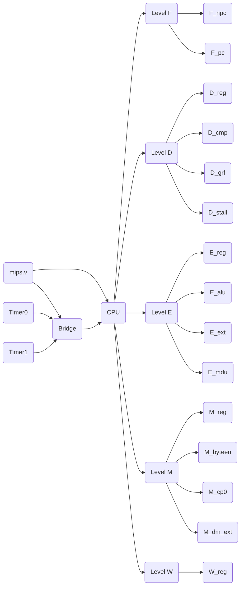
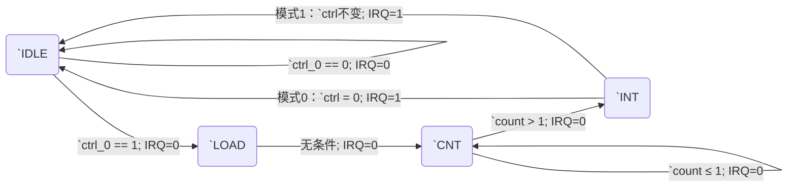

# Design Documents

## Design Architecture

### 总体设计

### 其他

&ensp;&ensp;&ensp;&ensp;除了顶层设计设计中展现的模块，我还为计算写入数据的移位以及计算ByteEn信号专门写了两个模块。

### 控制信号

控制信号有：
|       | MemWrite | RegWrite | Jr | Jump | Branch | ExtOp | ALUASrc | ALUBSrc | RegDst | RegDataSrc | MemType | TUseRs | TUseRt | Tnew | ALUOp | CmpOp | MDType |
|:-----:|:--------:|:--------:|:--:|:----:|:------:|:-----:|:-------:|:-------:|:------:|:----------:|:-------:|:------:|:------:|:----:|:-----:|:-----:|:------:|
| add   | 0        | 1        | 0  | 0    | 0      | 0     | rd1     | rd2     | rd     | alu        | dft     | 1      | 1      | 3    | add   | dft   | none   |
| addi  | 0        | 1        | 0  | 0    | 0      | 0     | rd1     | imm     | rt     | alu        | dft     | 1      |$\infty$| 3    | add   | dft   | none   |
| and   | 0        | 1        | 0  | 0    | 0      | 0     | rd1     | rd2     | rd     | alu        | dft     | 1      | 1      | 3    | and   | dft   | none   |
| andi  | 0        | 1        | 0  | 0    | 0      | 0     | rd1     | imm     | rt     | alu        | dft     | 1      |$\infty$| 3    | and   | dft   | none   |
| beq   | 0        | 0        | 0  | 0    | 1      | 1     | dft     | dft     | dft    | dft        | dft     | 0      | 0      | 0    | dft   | beq   | none   |
| bne   | 0        | 0        | 0  | 0    | 1      | 1     | dft     | dft     | dft    | dft        | dft     | 0      | 0      | 0    | dft   | bne   | none   |
| div   | 0        | 0        | 0  | 0    | 0      | 0     | rd1     | rd2     | dft    | dft        | dft     | 1      | 1      | 0    | dft   | dft   | div    |
| divu  | 0        | 0        | 0  | 0    | 0      | 0     | rd1     | rd2     | dft    | dft        | dft     | 1      | 1      | 0    | dft   | dft   | divu   |
| jal   | 0        | 1        | 0  | 1    | 0      | 0     | dft     | dft     | ra     | pc         | dft     |$\infty$|$\infty$| 3    | dft   | dft   | none   |
| jr    | 0        | 0        | 1  | 0    | 0      | 0     | dft     | dft     | dft    | dft        | dft     | 0      |$\infty$| 0    | dft   | dft   | none   |
| lb    | 0        | 1        | 0  | 0    | 0      | 1     | rd1     | imm     | rt     | mem        | type_b  | 1      | 2      | 4    | dft   | dft   | none   |
| lh    | 0        | 1        | 0  | 0    | 0      | 1     | rd1     | imm     | rt     | mem        | type_h  | 1      | 2      | 4    | dft   | dft   | none   |
| lui   | 0        | 1        | 0  | 0    | 0      | 0     | rd1     | imm     | rt     | alu        | dft     | 1      |$\infty$| 3    | lui   | dft   | none   |
| lw    | 0        | 1        | 0  | 0    | 0      | 1     | rd1     | imm     | rt     | mem        | type_w  | 1      | 2      | 4    | dft   | dft   | none   |
| mfhi  | 0        | 1        | 0  | 0    | 0      | 0     | dft     | dft     | rd     | hi/lo      | dft     |$\infty$|$\infty$| 3    | dft   | dft   | mfhi   |
| mflo  | 0        | 1        | 0  | 0    | 0      | 0     | dft     | dft     | rd     | hi/lo      | dft     |$\infty$|$\infty$| 3    | dft   | dft   | mflo   |
| mthi  | 0        | 0        | 0  | 0    | 0      | 0     | dft     | dft     | dft    | dft        | dft     | 1      |$\infty$| 0    | dft   | dft   | mthi   |
| mtlo  | 0        | 0        | 0  | 0    | 0      | 0     | dft     | dft     | dft    | dft        | dft     | 1      |$\infty$| 0    | dft   | dft   | mtlo   |
| mult  | 0        | 0        | 0  | 0    | 0      | 0     | rd1     | rd2     | dft    | dft        | dft     | 1      | 1      | 0    | dft   | dft   | mult   |
| multu | 0        | 0        | 0  | 0    | 0      | 0     | rd1     | rd2     | dft    | dft        | dft     | 1      | 1      | 0    | dft   | dft   | multu  |
| ori   | 0        | 1        | 0  | 0    | 0      | 0     | rd1     | imm     | rt     | alu        | dft     | 1      |$\infty$| 3    | or    | dft   | none   |
| or    | 0        | 1        | 0  | 0    | 0      | 0     | rd1     | rd2     | rd     | alu        | dft     | 1      | 1      | 3    | or    | dft   | none   |
| sb    | 1        | 0        | 0  | 0    | 0      | 1     | rd1     | imm     | dft    | dft        | type_b  | 1      | 2      | 0    | dft   | dft   | none   |
| sh    | 1        | 0        | 0  | 0    | 0      | 1     | rd1     | imm     | dft    | dft        | type_h  | 1      | 2      | 0    | dft   | dft   | none   |
| slt   | 0        | 1        | 0  | 0    | 0      | 0     | rd1     | rd2     | rd     | alu        | dft     | 1      | 1      | 3    | slt   | dft   | none   |
| sltu  | 0        | 1        | 0  | 0    | 0      | 0     | rd1     | rd2     | rd     | alu        | dft     | 1      | 1      | 3    | sltu  | dft   | none   |
| sub   | 0        | 1        | 0  | 0    | 0      | 0     | rd1     | rd2     | rd     | alu        | dft     | 1      | 1      | 3    | sub   | dft   | none   |
| sw    | 1        | 0        | 0  | 0    | 0      | 1     | rd1     | imm     | dft    | dft        | type_w  | 1      | 2      | 0    | dft   | dft   | none   |
| mfc0  | 0        | 1        | 0  | 0    | 0      | 0     | dft     | dft     | rt     | **dft**    | dft     |$\infty$|$\infty$| 4    | dft   | dft   | none   |
| mtc0  | 0        | 0        | 0  | 0    | 0      | 0     | dft     | dft     | dft    | dft        | dft     |$\infty$| 2      | 0    | dft   | dft   | none   |
| eret  | 0        | 0        | 0  | 0    | 0      | 0     | dft     | dft     | dft    | dft        | dft     |$\infty$|$\infty$| 0    | dft   | dft   | none   |
|syscall| 0        | 0        | 0  | 0    | 0      | 0     | dft     | dft     | dft    | dft        | dft     |$\infty$|$\infty$| 0    | dft   | dft   | none   |

## 思考题汇总

> 1、请查阅相关资料，说明鼠标和键盘的输入信号是如何被 CPU 知晓的？

&ensp;&ensp;&ensp;&ensp;CPU通过总线与各种外部设备相连接的。当鼠标和键盘输入进来时，输入信号通过统一的数据接口接入总线并传输给CPU。CPU接收到外部设备的中断信号会进行处理，并将结果反馈给用户。

> 2、请思考为什么我们的 CPU 处理中断异常必须是已经指定好的地址？如果你的 CPU 支持用户自定义入口地址，即处理中断异常的程序由用户提供，其还能提供我们所希望的功能吗？如果可以，请说明这样可能会出现什么问题？否则举例说明。（假设用户提供的中断处理程序合法）

&ensp;&ensp;&ensp;&ensp;CPU中断异常处理程序的地址入口如果是由用户提供的，那用户就累死了。

&ensp;&ensp;&ensp;&ensp;首先，异常处理程序应当是编写操作系统的程序员编写的，其目的在于为中断信号和异常信号提供统一的处理规范。对于用户来说，他们不应当看见CPU核心态异常处理程序的内容，而应当专注于用户态程序

&ensp;&ensp;&ensp;&ensp;其次，这样子做有一定可能会产生结构冒险，而用户是应当是没有必要知道底层储存器的存储结构会不会带来冒险的，CPU的冒险冲突不应当成为用户考虑的内容。

> 3、为何与外设通信需要 Bridge？

&ensp;&ensp;&ensp;&ensp;当外部输入设备繁多的时候，CPU设计者不可能针对每一种外部设备的都提供一套地址/数据，这样子的CPU设计会变得十分复杂。因此通过系统桥可以统一地进行数据和地址的分发以及相应控制信号的产生。

> 4、请阅读官方提供的定时器源代码，阐述两种中断模式的异同，并分别针对每一种模式绘制状态移图。
    

> 5、倘若中断信号流入的时候，在检测宏观 PC 的一级如果是一条空泡（你的 CPU 该级所有信息均为空）指令，此时会发生什么问题？在此例基础上请思考：在 P7 中，清空流水线产生的空泡指令应该保留原指令的哪些信息？

&ensp;&ensp;&ensp;&ensp;没有读懂题，什么叫所有信息均为空:question:

&ensp;&ensp;&ensp;&ensp;如果信息为空是浮空的意思，那么问题可大了，每一级的控制信号在空泡经过的时候都会浮空，暂停信号不知道要不要暂停，转发信号不知道要不要转发。
&ensp;&ensp;&ensp;&ensp;但是如果信息为空的意思是全部置0，那么问题也不小。比方说PC如果置0的话，空泡流经CP0所在流水级时即被判定为取址异常。如果控制信号在0时有定义的话，还可能会触发一些不该触发的效果，比方说定义ExcCode为0的时候为中断信号，那么似乎也不是很妙。

&ensp;&ensp;&ensp;&ensp;空泡应当保持前一条指令的PC一致。也就是除了指令本身需要变为`nop` ( 以及分布式译码中控制信号需要reset ) 以外，全部内容都应该就保持一致。

> 6、为什么 jalr 指令为什么不能写成 jalr \$31, \$31？

&ensp;&ensp;&ensp;&ensp;说来好笑，P5的一道上机题解释过这个问题，并且还叫我们加一条新的指令来解决这个问题:joy::joy::joy:

&ensp;&ensp;&ensp;&ensp;P5的那道题目中是这么说的：“`jalr`指令并没有对$rs == rt$的情况进行定义”。因为`jalr`指令既要完成读取 GRF 操作，又要完成写入 GRF 操作，因此究竟是写后读还是读后写呢？MIPS指令集并没有对此进行定义。
&ensp;&ensp;&ensp;&ensp;具体来说， MIPS 指令集不应当考虑流水线中的实现细节。在用户看来，指令应当没有流水级的概念，也就是说指令的所有效果应当是同时完成的。那一条指令同时读写同一个寄存器就会出问题了。

> 1、[P7 选做] 请详细描述你的测试方案及测试数据构造策略。
    
&ensp;&ensp;&ensp;&ensp;首先，对于异常指令来说，应当包括各类异常
&ensp;&ensp;&ensp;&ensp;其次，应当让异常指令与各种指令组合。这里说几个特例。①与乘除指令组合②让乘除指令$RI$异常③让异常指令成为延迟槽④异常指令与计算指令组合⑤让异常指令与存储指令结合，包括往timer中存。
&ensp;&ensp;&ensp;&ensp;然后，应当考虑中断。中断与异常不同，中断可以发生在任何时钟周期，而不只是指令周期。因此中断相较异常需要考虑的多的一点是在空泡中断。

## 测试方案
主要是对每一种异常进行了测试；此外对空泡的中断进行了测试。详细见`*.asm`文件