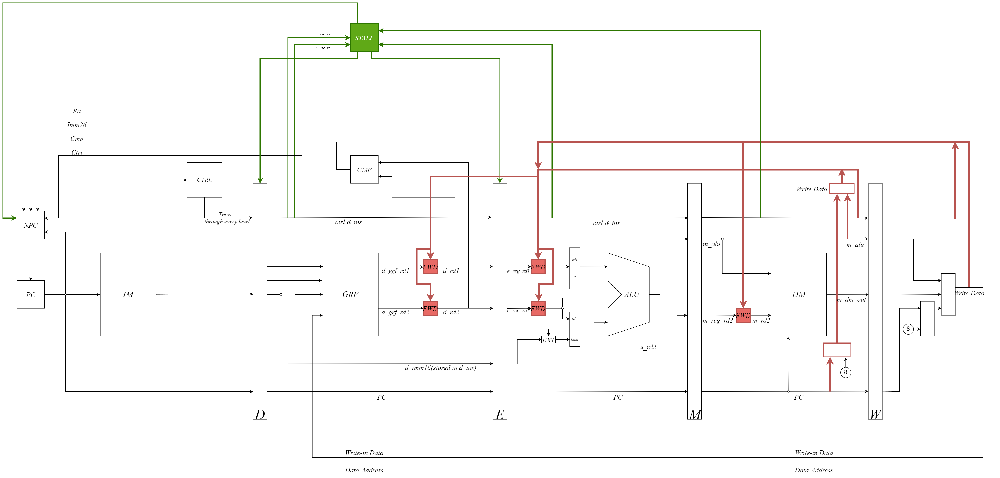

# BUAA-CO-2023-Aut

Squirrel7ang的北航计算机学院2023-2024学年计算机组成实验课 课下设计

## 关于本人

&ensp;&ensp;&ensp;&ensp;本人计组小菜鸡，目前进度P7AK（2022级取消P8）回顾一学期的计算机组成实验课，个人犯了很多错误，也出闹出过很多笑话。希望课下设计和博客能够给后来者带来一些启发。

&ensp;&ensp;&ensp;&ensp;博客链接: [Squirrel7ang's Blog](https://squirrel7ang.github.io)

## 关于其他博客

&ensp;&ensp;&ensp;&ensp;在计算机组成的学习过程中，前人的博客给了我很大启发，尤其是FlyingLandlord和Roife的博客:
* [FlyingLandlord's Blog](https://flyinglandlord.github.io/)
* [ROIFE BLOG](https://roife.github.io/)

这两篇博客对课上课课下做出了很详细很全面的经验分享，非常值得借鉴

此外还有Toby的博客：[TobyShiの博客](https://toby-shi-cloud.github.io/)

[rfhits的Github仓库](https://github.com/rfhits/Computer-Organization-BUAA-2020)记录了很多前人的仓库和代码。

[Coekjan's Blog](https://coekjan.github.io/)对具体的CPU设计也写得十分详细。

**感谢前辈们的帮助！**

## 关于课上实验

&ensp;&ensp;&ensp;&ensp;关于个人建议请戳[这里](https://squirrel7ang.github.io/categories/CO)

&ensp;&ensp;&ensp;&ensp;P5开始设计变得稍微有点复杂，因此在Design_Document文件里面画了几张电路图辅助理解。

### Pre

&ensp;&ensp;&ensp;&ensp;检查课前同学们在Logisim、Verilog和MIPS汇编语言的预习效果。2022级Pre不计入实验课总评成绩（坐牢三小时，本人果断选择挂掉），同时从Pre到P2的每一次上机考试由两小时延长至三小时。

&ensp;&ensp;&ensp;&ensp;上机题一共3道，分别对应Logisim、Verilog和MIPS。Logisim和Verilog基本上就是搭建有限状态机，MIPS汇编要求写一个简单的程序（比如2022级MIPS找数列最大值）。基本上好好预习了都能随便AK。

### P0

&ensp;&ensp;&ensp;&ensp;2022级P0到P2课上实验如果挂了可以在课下进行补交，只要在下一次P的课下提交截止之前在平台上补交并通过测评就能正常推进实验进度。

&ensp;&ensp;&ensp;&ensp;P0课上三道题目全部都是搭建有限状态机，所以请务必掌握如何用Logisim搭建有限状态机。上机考试开始前，可以现在本地手搓个Moore机和Mealy机的模板（反正15分钟闲着没事干），考试开始之后直接调用。

&ensp;&ensp;&ensp;&ensp;Pre-P2的题目可以参考[fysszlr's blog](https://www.fysszlr.top/categories/%E7%BB%8F%E9%AA%8C/)及其仓库。

### P1

&ensp;&ensp;&ensp;&ensp;P1课上3道题目全部都是搭建有限状态机，而教程中对Verilog搭建有限状态机给出了三种不同的实现方式，因此按照教程的模板搭建即可。另一方面，个人认为最开始接触Verilog的时候可能会写出很多很多的bug，按照模板来写至少不会出现诡异的bug。

&ensp;&ensp;&ensp;&ensp;如果不放心，P1课上考试前可以建好项目写一些简单的模板（反正15分钟闲着没事干）；如果有自信，完全可以不做测试直接交（毕竟简单，而且少坐牢，不过话说在前头，不写测试可能会被助教指责）。

### P2

&ensp;&ensp;&ensp;&ensp;P2考察MIPS汇编语言的掌握。简单的代码基本上直接MIPS爆干就行，复杂一点的题目会给出C代码，对着无脑翻译即可，基本不会有问题（实不相瞒第一题我也是先写C代码然后翻译的）。

&ensp;&ensp;&ensp;&ensp;P2课上考试开始前可以在考场写宏定义（反正15分钟闲着没事干）。

### P3

&ensp;&ensp;&ensp;&ensp;P3开始进行单周期CPU的搭建工作，P3要求使用Logisim搭建单周期CPU。由于最复杂的GRF在课下已经搭建完成了，P3整体工作量并不大，有ddl可以先肝ddl。感兴趣的话可以在P3和P4的搭建周把自动化测评给整出来，之后流水线CPU的测评也可以用。

### P4

&ensp;&ensp;&ensp;&ensp;将P3的单周期CPU翻译成Verilog语言，再加几条指令即可。不同点在于P3能用导线连接，而P4要用wire类型给导线命个名。本人第一次搭建P4就没有不浮空的值，果断选择了重构。整体开发工作量并不大，小几个小时就能做完。

### P5

&ensp;&ensp;&ensp;&ensp;P5开始工作量陡然增加，时间不充裕的同学应当提前做好准备。P5开始进行流水线CPU的开发设计。个人建议在开发前进行充分的思考和设计在动手，以避免大规模重构。P5相较于单周期难在对冲突冒险的解决上，在开发前建议提前了解$T_{Use}$和$T_{New}$是如何用于判断转发和暂停的；选择集中式译码和分布式译码。之后的P都可以在P5的基础上进行迭代开发（当然也可以重构）。

&ensp;&ensp;&ensp;&ensp;本人的P5以及后续的迭代开发设计有很多问题，在参考时应当注意。
1. D级叫Decode级不是没有原因的，不应该把控制器ctrl放在F级。这样会使得F级需要同时完成取指令和译码操作，大大增加始终周期；同时D级由于不需要进行译码操作，读写几个寄存器不会花费太多时间。因此会降低CPU性能。好处就是F级也有控制信号啦。
2. 转发应当从流水寄存器转发，但是在本人的设计中是过了一到两个多路选择器，延长关键路径，降低CPU性能。设计初衷在于将所有值都流水下去，以防上机题出的诡异。
3. 转发模块没有进行$T_{Use}$和$T_{New}$的比较。只要后面的流水级对寄存器数值进行了更新就进行转发。$T_{Use}$和$T_{New}$只用于阻塞的判断。事实证明这也没有什么大问题。

&ensp;&ensp;&ensp;&ensp;P5上机题可以参考Roife和FlyingLandlord的博客。大体来说添加的指令有三类：
1. 算术类指令。基本上是Verilog语法题。
2. 条件bal、条件jral等跳转指令。注意一下条件link就基本不会出错了。
3. 不定寄存器load指令，即load到的目标寄存器在从Memory取出来之前无法确定或只能部分确定的指令。阻塞住就行。

&ensp;&ensp;&ensp;&ensp;P5是个小难点，挂了和Gap了都不用慌，认真准备好下一次就行。

### P6

&ensp;&ensp;&ensp;&ensp;增加了乘除指令，同时在P5的基础上增加了几条算术和分支指令。需要注意的乘除指令引入的新的冒险和阻塞。运气好一晚上解决，运气不好debug三天。

&ensp;&ensp;&ensp;&ensp;P6上机题几乎与P5完全相同，除了算术指令题目更改为乘除算术指令以外几乎没有变化。

### P7

&ensp;&ensp;&ensp;&ensp;没有提交设计文档而Gap一周是最难绷的一集

&ensp;&ensp;&ensp;&ensp;增加对简单的异常处理和中断处理的支持。整体难度较高，但主要问题是容易考虑不全面。建议多和同学交流、多看讨论区、多看教程和高老板的课件。基本上只要考虑全面了就不会有任何问题；P7由计时器产生的中断无法与Mars进行对拍，官方Mars的行为和官方教程的描述有差异，如果和小伙伴们的设计差异带来了时钟周期的差异，那么也不方便对拍。

&ensp;&ensp;&ensp;&ensp;个人设计中P7问题很多、非常多。参考时要注意。

## 总之，计组一定会是一段美好的记忆，加油！AK！

